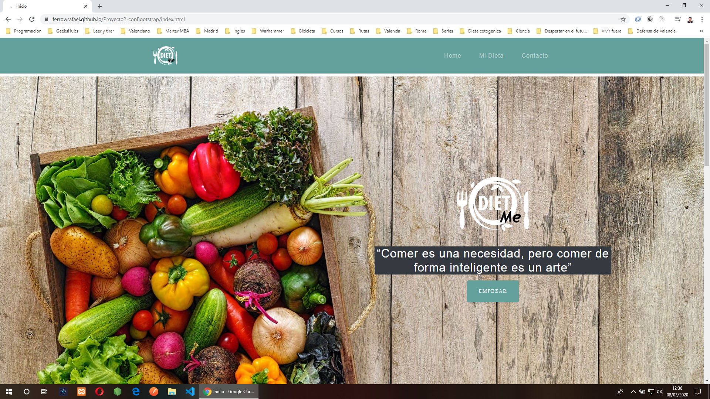
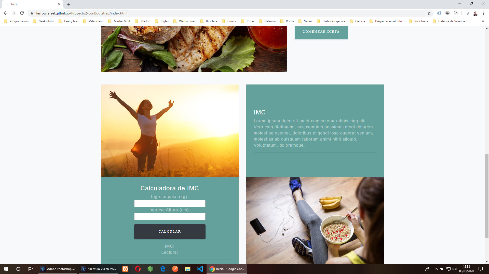
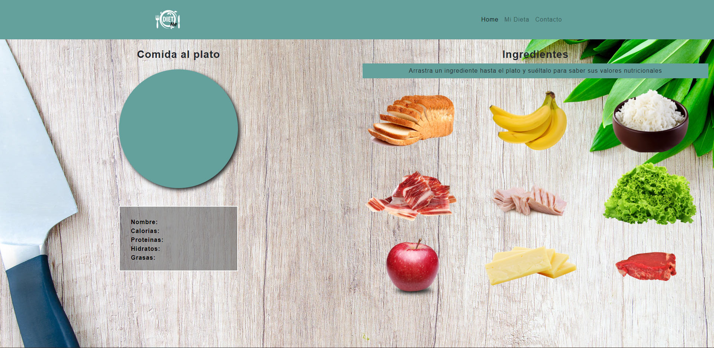
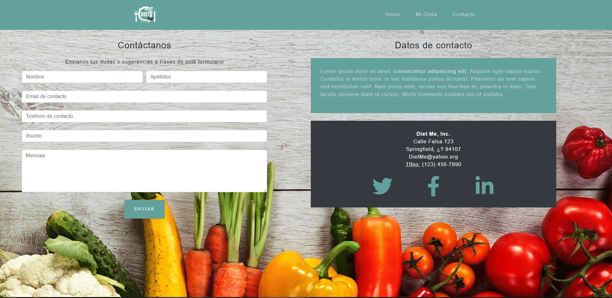

# Diet Me - Organiza tu dieta

Página web dedicada a la dietetica, donde puedes conocer los valores nutricionales de los alimentos y juntarlos para prepararte un menu diario.

## Getting Started 🚀 

[Prueba la Demo](https://ferrowrafael.github.io/Proyecto2-conBootstrap/) 

O puedes clonarte el repositorio utilizando git clone (direccion del repositorio)

## Built With 🛠️    

* HTML
* CSS
* Bootstrap
* HTML API (Drag&Drop)
* Javascript

## Conocimientos

* He utilizado clases de JS para almacenar los alimentos y Bootstrap para maquetar la web de forma rapida.
* Me he inspirado en otras webs y apps como:
  ** [Medicinainformacion](https://medicinainformacion.com/)
  ** [Lifesum](https://lifesum.com/es/)

## Author 👨🏼‍💻

* **Rafael Fernández Gómez** - [FerrowRafael](https://github.com/FerrowRafael)

## Preview

# Página de Inicio

</a>

</a>

# Pagina Principal

</a>

# Página de Contacto

</a>

